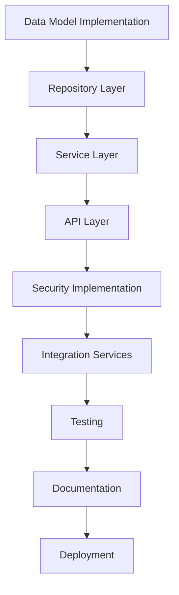

# Taly Platform: Bounded Context Definition and Mapping

**Version:** 1.0 (Draft)  
**Last Updated:** 2025-03-11  
**Architecture:** Monolithic (NestJS, Prisma, PostgreSQL)

## Table of Contents
1. [Introduction](#1-introduction)
2. [Bounded Contexts Overview](#2-bounded-contexts-overview)
3. [Context Details and Entities](#3-context-details-and-entities)
   - [3.1 Authentication](#31-authentication)
   - [3.2 User Management](#32-user-management)
   - [3.3 Company Management](#33-company-management)
   - [3.4 Client Management](#34-client-management)
   - [3.5 Booking Management](#35-booking-management)
   - [3.6 Payment Processing](#36-payment-processing)
   - [3.7 Subscription Management](#37-subscription-management)
   - [3.8 Notification Management](#38-notification-management)
   - [3.9 Website Builder](#39-website-builder)
   - [3.10 Reporting](#310-reporting)
4. [APIs and Events](#4-apis-and-events)
5. [Implementation Roadmap](#5-implementation-roadmap)

## 1. Introduction

This document defines the bounded contexts within the Taly company management platform, a monolithic application built using NestJS and Prisma. It outlines the key entities, relationships, and responsibilities of each context. The purpose is to establish a clear domain model, promote modularity within the monolith, and facilitate consistent development.

## 2. Bounded Contexts Overview

The Taly platform is organized into the following bounded contexts. Although initially implemented as a modular monolith, these contexts have been designed with clear boundaries to facilitate future extraction into microservices when scale requires it:

| Context | Primary Responsibility | Implementation Details |
|---------|------------------------|------------------------|
| **Authentication** | User authentication and authorization | NestJS authentication module with Passport strategies (JWT, OAuth), integrated with Auth.js on frontend |
| **User Management** | User profiles, roles, and staff information | Separate database schema with role-based access control and staff hierarchy management |
| **Company Management** | Company profiles, services, and working hours | Core domain model with complex business rules for service categorization and availability management |
| **Client Management** | Client profiles, preferences, and communication history | Customer-focused domain with privacy controls and GDPR-compliant data handling |
| **Booking Management** | Appointments, scheduling logic, and availability engine | Transaction-heavy domain with complex constraint validation and conflict resolution |
| **Payment Processing** | Payment transactions, refunds, and payment methods | PCI-compliant isolated context with strict audit logging and reconciliation processes |
| **Subscription Management** | Subscription plans, billing, and feature entitlements | Recurring revenue management with metering, usage tracking, and plan migration logic |
| **Notification Management** | Multi-channel messaging with templates and delivery tracking | Event-driven design with provider adapters and delivery guarantees |
| **Website Builder** | Website templates, content management, and domain configuration | Componentized system with versioned templates and publishing workflow |
| **Reporting** | Analytics generation, data aggregation, and visualization | Read-model optimized with materialized views and ETL processes |

Each bounded context maintains:

1. **Dedicated Database Schema**: Separate tables with context-specific naming conventions
2. **Context-Specific DTOs**: Domain objects that don't leak implementation details across boundaries
3. **Isolated Business Logic**: Services and validators unique to the context's domain
4. **Well-Defined Interfaces**: Clear API contracts for cross-context communication
5. **Event Publishers**: Domain events for notifying other contexts of significant state changes

## 3. Context Details and Entities

### 3.1 Authentication

**Purpose:** Manages user login, registration, password reset, and token generation/validation (JWT). Handles OAuth 2.0 integration.

**Entities:**
- **User:** (from User Management context, but used here for authentication with password field)
- **RefreshToken:** Stores refresh tokens for secure session management

**Relationships:**
- User 1:1 RefreshToken

**Notes:**
- This context is primarily concerned with verifying credentials and issuing tokens
- User profile data is managed by the User Management context
- OAuth provider information (provider, providerId) is stored on the User entity
- RefreshToken entity enables token revocation and longer-term sessions without compromising access tokens

### 3.2 User Management

**Purpose:** Manages user profiles and roles. Handles the creation and management of staff members.

**Entities:**
- **User:** Contains fields like firstName, lastName, email, role, isActive, avatar, phone, address
  - role is an enum (ADMIN, STYLIST, CLIENT)
- **Staff:** Extends User with additional fields: permissions (JSON), department, position, employeeId, hireDate

**Relationships:**
- User 1:1 Staff (optional relationship)

**Notes:**
- The User entity is central to the system and used for both staff and clients
- The role field differentiates between different user types
- The Staff entity provides additional information specific to staff members

### 3.3 Company Management

**Purpose:** Manages information about companys, their services, and working hours.

**Entities:**
- **Company:** Core entity with company details (name, address, contact info, images)
- **Service:** Services offered by the company (name, price, duration, etc.)
- **WorkingHours:** Defines when the company is open
- **StaffSchedule:** Defines when staff members are available at specific companys

**Relationships:**
- Company 1:many Service
- Company 1:many WorkingHours
- Company 1:1 User (owner)
- Company 1:many StaffSchedule
- Staff 1:many StaffSchedule

### 3.4 Client Management

**Purpose:** Manages client information and client-specific notes.

**Entities:**
- **Client:** Stores client information, preferences, and medical data
- **ClientNote:** Captures notes about clients made by staff members

**Relationships:**
- Client 1:many ClientNote
- Client 1:1 User (optional relationship)
- Client 1:many Company (FK)

### 3.5 Booking Management

**Purpose:** Handles appointment scheduling, reminders, and time slot management.

**Entities:**
- **Appointment:** Records of scheduled services with status tracking
- **Reminder:** Notifications for upcoming appointments
- **TimeSlot:** Available time slots for booking appointments

**Relationships:**
- Appointment 1:many Reminder
- Appointment 1:1 User
- Appointment 1:1 Company
- Appointment 1:1 Service
- Appointment 1:1 Client
- TimeSlot 1:1 Company (FK)
- TimeSlot 1:many Staff (FK)

### 3.6 Payment Processing

**Purpose:** Manages payment transactions, methods, and refunds.

**Entities:**
- **Payment:** Records of payments made for appointments
- **PaymentMethod:** Stored payment methods (tokens only, no sensitive data)
- **Transaction:** Detailed transaction history with provider responses
- **Refund:** Records of refunded payments

**Relationships:**
- Payment 1:1 User
- Payment 1:1 Appointment
- Payment 1:many Transaction
- Payment 1:many Refund
- PaymentMethod 1:many User
- Transaction 1:1 Payment
- Transaction 1:1 User
- Refund 1:1 Payment

### 3.7 Subscription Management

**Purpose:** Manages subscription plans and user subscriptions.

**Entities:**
- **Subscription:** Records of user subscriptions to plans
- **Plan:** Defines subscription offerings with pricing
- **Feature:** Individual features included in subscription plans

**Relationships:**
- Subscription 1:1 User
- Subscription 1:1 Plan
- Plan 1:many Feature

### 3.8 Notification Management

**Purpose:** Handles sending various types of notifications.

**Entities:**
- **Notification:** Records of sent notifications with status tracking
- **NotificationTemplate:** Customizable templates for different notification types

**Relationships:**
- Notification 1:many User

### 3.9 Website Builder

**Purpose:** Enables companys to create and manage simple websites.

**Entities:**
- **Website:** Core entity for company websites
- **Theme:** Website themes with customization options
- **Page:** Individual pages within a website
- **CustomDomain:** Custom domain configuration for websites

**Relationships:**
- Website 1:1 User
- Website 1:1 Theme
- Website 1:many Page
- Website 1:1 CustomDomain
- Page 1:many Website

### 3.10 Reporting

**Purpose:** Generates and stores business reports.

**Entities:**
- **Report:** Stores report configurations and data

**Relationships:**
- None in the actual entity (storage only)

## 4. APIs and Events

### REST API Examples

**Users:**
- `GET /users` - Get all users (with pagination, filtering, and sorting)
- `GET /users/:id` - Get a user by ID
- `POST /users` - Create a new user
- `PATCH /users/:id` - Update a user
- `DELETE /users/:id` - Delete a user
- `GET /users/me/profile` - Get current user's profile
- `POST /users/staff` - Create a new staff member

### GraphQL Examples

**Users:**
```graphql
Query: users(page: Int, limit: Int, search: String): [User]
Query: user(id: ID!): User
Mutation: createUser(input: CreateUserInput!): User
Mutation: updateUser(id: ID!, input: UpdateUserInput!): User
Mutation: deleteUser(id: ID!): Boolean
```

### Event-Driven Communication

Even within a monolith, an event-driven approach can be used for certain operations:

```typescript
// Booking Service
async createBooking(data) {
  // ... create booking in database ...
  this.eventEmitter.emit('booking.created', { bookingId: newBooking.id, ... }); 
  // ...
}

// Notification Service
@OnEvent('booking.created')
async handleBookingCreated(payload: any) {
  // ... send confirmation email/SMS using data from payload ...
}
```

This approach makes it easier to transition to microservices later if desired.

## 5. Implementation Roadmap

1. **Data Model Implementation**
   - Complete the Prisma schema file with all entities
   - Define relationships and data types properly
   - Add indexes and constraints

2. **Repository Layer**
   - Implement repository interfaces for each context
   - Create repository implementations using Prisma Client
   - Add transaction support for complex operations

3. **Service Layer**
   - Implement business logic in service classes
   - Ensure proper validation and error handling
   - Implement domain events where appropriate

4. **API Layer**
   - Create REST controllers for each context
   - Implement GraphQL resolvers where needed
   - Add input validation and transformation

5. **Security Implementation**
   - Set up JWT authentication
   - Implement role-based access control
   - Configure OAuth providers

6. **Integration Services**
   - Create notification providers (email, SMS, push)
   - Implement payment gateway integrations
   - Set up external service connectors

7. **Testing**
   - Write unit tests for services
   - Create integration tests for repositories
   - Implement E2E tests for API endpoints

8. **Documentation**
   - Generate API documentation
   - Create user guides
   - Document integration points

9. **Deployment**


</details>

<details> # Path: taly/docs/README.md
# Taly Platform Documentation 

This repository contains the documentation for the Taly platform, a company management system built using NestJS and Prisma. The documentation is organized into the following sections:

## Table of Contents 

1. [Introduction](#introduction)
2. [Bounded Contexts Overview](#)
3. [Context Details and Entities](#)
4. [APIs and Events](#)
5. [Implementation Roadmap](#)

## 1. Introduction

This document defines the bounded contexts within the Taly company management platform, a monolithic application built using NestJS and Prisma. It outlines the key entities, relationships, and responsibilities of each context. The purpose is to establish a clear domain model, promote modularity within the monolith, and facilitate consistent development.

## 2. Bounded Contexts Overview

The Taly platform is organized into the following bounded contexts. Although this is a monolith, these contexts represent logical divisions of the domain, which could be separated into microservices in the future:

| Context | Primary Responsibility |
|---------|------------------------ |

```mermaid
graph TD
      A[Authentication] --> B[User Management]
      B --> C[Company Management]
      C --> D[Client Management]
      D --> E[Booking Management]
      E --> F[Payment Processing]
      F --> G[Subscription Management]
      G --> H[Notification Management]
      H --> I[Website Builder]
      I --> J[Reporting]
   ```
</details>

<details>

