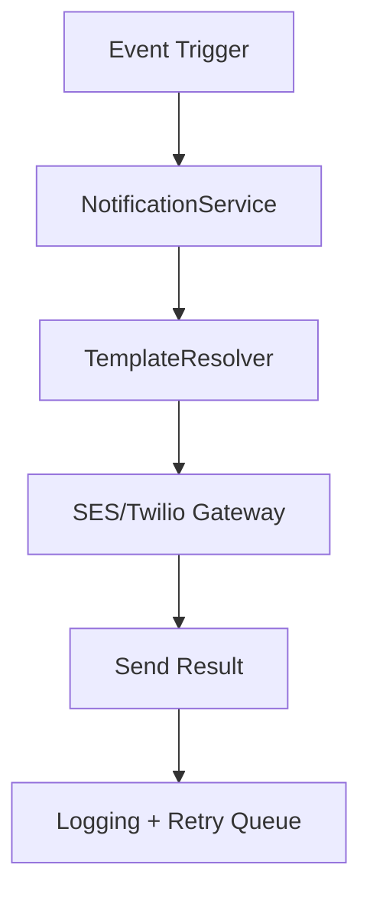

# Notification API Documentation

## Overview

The Notification API handles the dispatching of email and SMS notifications for the Taly CRM platform. It provides endpoints for sending, scheduling, and managing notifications related to bookings, payments, and user activities.

## Base URL

```
https://api.taly.dev/notification
```

---

## Architecture Overview

| Channel | Provider       | Purpose                          |
|---------|----------------|----------------------------------|
| Email   | Amazon SES     | Booking confirmations, reminders |
| SMS     | Twilio         | Short booking reminders          |
| Push    | Planned (FCM)  | Realtime status updates          |

All notifications are processed via:
- Backend jobs (NestJS `@Schedule`)
- Serverless handlers (`serverless/send-email`, etc.)
- Manual API calls (admin messages)

---

## **1. Notification Management**

### Notification Events

| Event                      | Channel(s)       | Trigger Source             |
|----------------------------|------------------|----------------------------|
| Appointment booked         | Email, SMS       | AppointmentService         |
| Appointment reminder (24h) | Email, SMS       | Cron (Scheduled job)       |
| Appointment cancelled      | Email            | AppointmentService         |
| Payment receipt            | Email            | PaymentService             |
| User registration          | Email            | AuthService                |
| Subscription upgraded      | Email            | Stripe webhook             |

> Event types are defined in:  
`@api/src/notifications/constants/notification-events.enum.ts`

---

### Notification Flow



---

### **1.1 Send a Notification**

**Endpoint:** `POST /notification/send`

**Description:** Sends an email or SMS notification to a user.

**Request Body:**

```json
{
  "userId": 1,
  "type": "email",
  "subject": "Booking Confirmation",
  "message": "Your booking has been confirmed for June 15, 2024, at 2:00 PM."
}
```

**Response:**

```json
{
  "notificationId": 501,
  "status": "sent",
  "timestamp": "2024-06-10T10:00:00Z"
}
```

**Errors:**

- `400 Bad Request` – Invalid input data.
- `404 Not Found` – User not found.
- `500 Internal Server Error` – Notification service failure.

---

### **1.2 Get Notification by ID**

**Endpoint:** `GET /notification/{id}`

**Description:** Retrieves a specific notification by ID.

**Response:**

```json
{
  "notificationId": 501,
  "userId": 1,
  "type": "email",
  "subject": "Booking Confirmation",
  "message": "Your booking has been confirmed for June 15, 2024, at 2:00 PM.",
  "status": "sent",
  "timestamp": "2024-06-10T10:00:00Z"
}
```

**Errors:**

- `404 Not Found` – Notification not found.

---

### **1.3 List Notifications for a User**

**Endpoint:** `GET /notification/user/{userId}`

**Description:** Retrieves all notifications sent to a specific user.

**Response:**

```json
[
  {
    "notificationId": 501,
    "type": "email",
    "subject": "Booking Confirmation",
    "status": "sent"
  },
  {
    "notificationId": 502,
    "type": "sms",
    "subject": "Payment Receipt",
    "status": "delivered"
  }
]
```

**Errors:**

- `404 Not Found` – No notifications found for the user.

---

### **1.4 Schedule a Notification**

**Endpoint:** `POST /notification/schedule`

**Description:** Schedules a notification to be sent at a future date and time.

**Request Body:**

```json
{
  "userId": 1,
  "type": "email",
  "subject": "Upcoming Appointment Reminder",
  "message": "Reminder: You have an appointment on June 15, 2024, at 2:00 PM.",
  "sendAt": "2024-06-14T12:00:00Z"
}
```

**Response:**

```json
{
  "notificationId": 503,
  "status": "scheduled",
  "sendAt": "2024-06-14T12:00:00Z"
}
```

**Errors:**

- `400 Bad Request` – Invalid input data.
- `500 Internal Server Error` – Unable to schedule notification.

---

### **1.5 Cancel a Scheduled Notification**

**Endpoint:** `DELETE /notification/cancel/{id}`

**Description:** Cancels a scheduled notification before it is sent.

**Response:**

```json
{
  "message": "Notification cancelled successfully."
}
```

**Errors:**

- `404 Not Found` – Notification not found or already sent.
- `403 Forbidden` – Cannot cancel an already processed notification.

---

## **2. Implementation Details**

### Email API (Backend)

**Triggering an Email:**

```typescript
await this.notificationService.sendEmail({
  to: user.email,
  subject: 'Booking Confirmation',
  template: 'booking-confirmation',
  context: {
    fullName: user.fullName,
    startTime: appointment.startTime,
    service: appointment.service.name,
  },
});
```

**Available Templates:**

- `booking-confirmation`
- `booking-cancelled`
- `appointment-reminder`
- `payment-receipt`
- `welcome-user`
- `plan-upgrade`

Templates are located in:

```
api/src/mail/templates/*.hbs
```

> Uses `handlebars` for dynamic content rendering.

---

### SMS API (Backend)

```typescript
await this.notificationService.sendSMS({
  to: '+447911123456',
  message: `Your booking is confirmed for 10:30 AM tomorrow.`,
});
```

**Twilio Setup:**

- Configured in `.env`:
  ```
  TWILIO_ACCOUNT_SID=
  TWILIO_AUTH_TOKEN=
  TWILIO_FROM_NUMBER=
  ```

- Messages are sent using `twilio` SDK wrapper in:
  `@api/src/notifications/providers/twilio.provider.ts`

---

### Reminder Jobs

Handled via NestJS scheduler:

```typescript
@Cron('0 9 * * *') // every day at 9 AM
handleDailyReminders() {
  this.notificationService.sendUpcomingReminders();
}
```

Logic:
- Queries appointments within 24h
- Filters users with reminder preferences enabled
- Sends email and/or SMS

---

### Retry Logic & Failures

Failures are logged to:

```
logs/notifications/failed-<timestamp>.log
```

Planned retry queue (v2):
- Failed emails/SMS are retried 3 times
- After 3 failures, fallback email is sent to admin
- Retry mechanism will be migrated to serverless queue

---

### Notification Preferences

Coming soon:
- User-configurable preferences via `/settings`
- Stored in user table (`emailNotifications`, `smsNotifications`)
- Will integrate with frontend toggle UI components

---

### API Error Handling

| Status Code | Meaning                        |
|-------------|--------------------------------|
| 400         | Invalid template or payload    |
| 403         | Forbidden (role)               |
| 429         | Rate-limited (per user/email)  |
| 500         | Delivery failed                |

---

### Serverless Support

Notifications may also be sent from:

```
serverless/send-email
```

Used for:
- Async reporting notifications
- Daily analytics summary
- Webhook-confirmed status emails

---

### Related Files

| File | Purpose |
|------|---------|
| `notification.service.ts` | Centralised email/SMS gateway logic |
| `mail/templates/*.hbs`    | Handlebars email templates          |
| `twilio.provider.ts`     | SMS provider wrapper                |
| `mail.module.ts`         | SES config and mailer transport     |
| `reminder.scheduler.ts`  | Cron-based reminders                |

---

## **3. Security & Authentication**

- **All requests require JSON Web Token (JWT)**, except for system-triggered notifications.
- **Use the `Authorization` header for authentication**:
  ```
  Authorization: Bearer <JWT_TOKEN>
  ```
- **RBAC applies**, restricting notification actions to users with the appropriate permissions.

---

## **4. Environment Variables**

```env
# Email (SES)
AWS_SES_REGION=
AWS_SES_ACCESS_KEY=
AWS_SES_SECRET_KEY=

# SMS (Twilio)
TWILIO_ACCOUNT_SID=
TWILIO_AUTH_TOKEN=
TWILIO_FROM_NUMBER=
```

---

## **Contact & Support**

For any issues, please contact:
- Slack: `#taly-notifications`
- Email: `ops@taly.dev` or `support@taly.dev`
- Documentation: [Taly API Docs](https://api.taly.dev/docs)

---

_Last updated: {{DATE}}_
